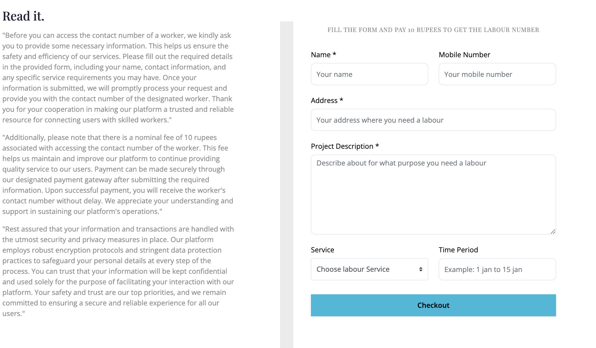
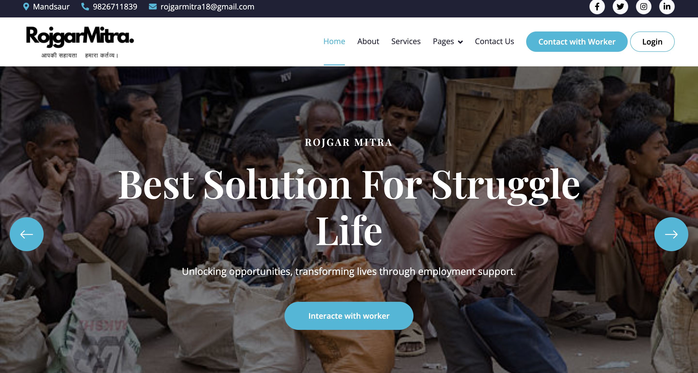
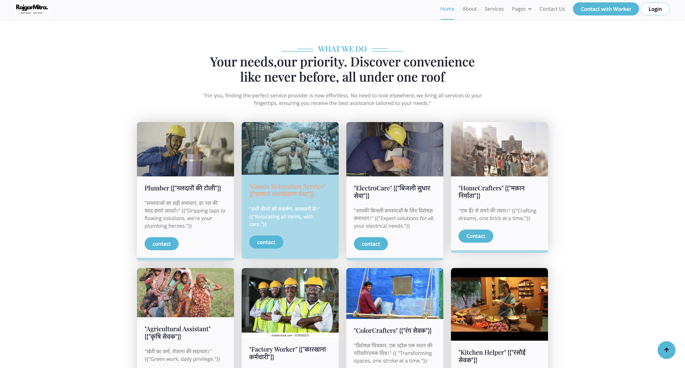
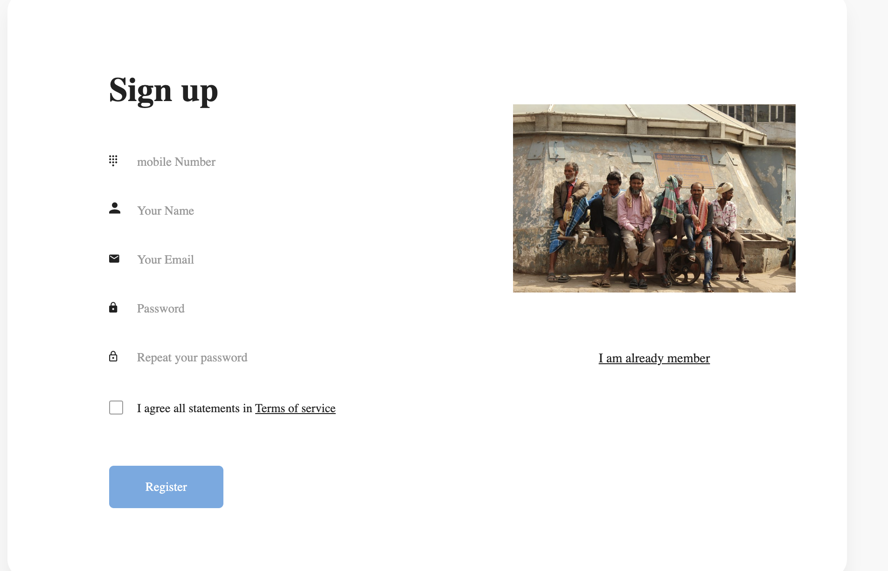
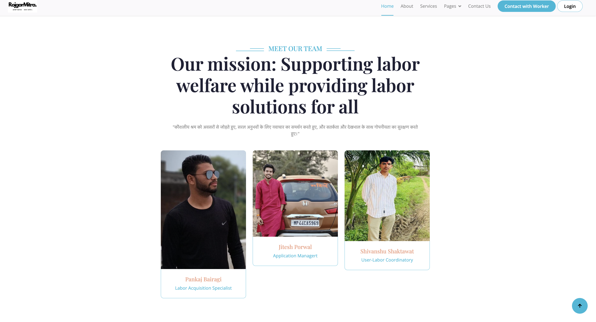
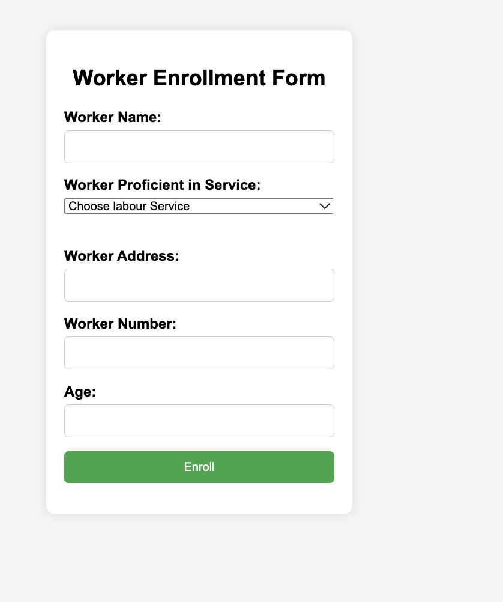

# Rozgar Mitra

Created a user-friendly interface to connect users with skilled laborers for various tasks efficiently.

## Project Overview
The Rozgar Mitra project provides a comprehensive solution for connecting users with skilled laborers. It aims to simplify the hiring process through an intuitive platform, enhancing both user experience and operational efficiency.

## Features

1.Efficient Labor Matching: Connects users with skilled laborers for various tasks.
2.User-Friendly Interface: Easy-to-navigate design for a seamless user experience.
3.Robust Search and Filter Options: Find laborers based on skills, location, and availability.
4.Secure User Profiles: Verified profiles and secure transactions.
5.Real-Time Notifications: Instant updates and alerts to keep users informed.

## Installation
To get started with the Rozgar Mitra project, follow these steps:

Clone the repository:
bash
Copy code
- git clone https://github.com/your-username/rozgar-mitra.git
Navigate to the project directory:
bash
Copy code
cd rozgar-mitra

## Screenshots
Here are some screenshots of the Rozgar Mitra platform:

- 
- 
- 
- 
- 
- 
- 

